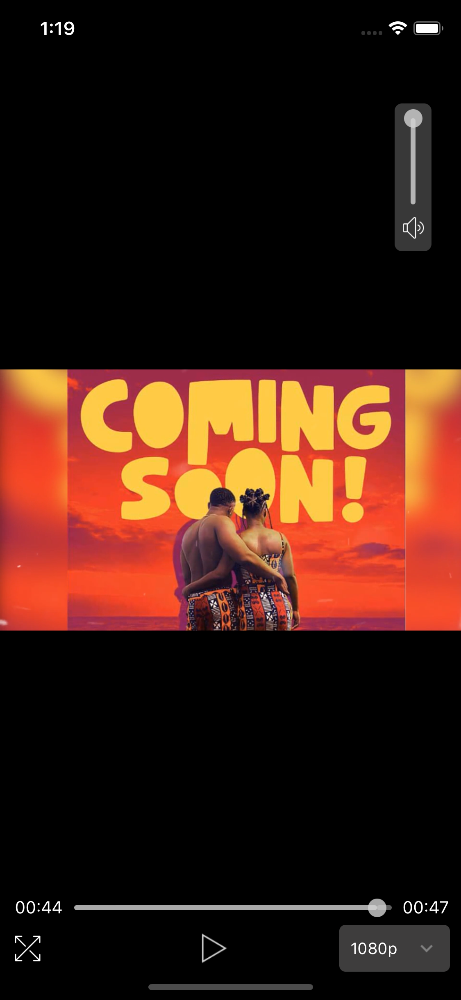

# React-Native Media Player


## Overview

`React Native Media Player` is a React Native component built using `amazon-ivs-react-native-player`, which allows you to integrate Amazon IVS (Interactive Video Service) player with customizable controls and features into your React Native application.

## Installation

First, install the necessary dependencies:



```sh
npm install amazon-ivs-react-native-player react-native-element-dropdown @react-native-assets/slider styled-components
```

Then, import and use the `IVSPlayerComponent` in your application.

## Usage

```jsx
import React from 'react';
import IVSPlayerComponent from './IVSPlayerComponent';

const App = () => {
  return (
    <IVSPlayerComponent
      streamUrl="your_stream_url_here"
      autoplay={true}
      loop={true}
      muted={false}
      initialPaused={false}
      playbackRate={1.0}
      defaultVolume={1.0}
      autoQualityMode={true}
      isFullScreen={false}
      hideSeekBar={false}
      onError={(error) => console.error(error)}
      onLoadStart={() => console.log('Loading started')}
      onRebuffering={() => console.log('Rebuffering')}
      onVideoStatistics={(stats) => console.log(stats)}
      onLiveLatencyChange={(latency) => console.log('Latency: ', latency)}
    />
  );
};

export default App;
```

## API

### IVSPlayerComponent Props

| Prop                                 | Type                  | Default     | Description                                                                  |
|--------------------------------------|-----------------------|-------------|------------------------------------------------------------------------------|
| `streamUrl`                          | `string`              | `undefined` | URL of the video stream.                                                     |
| `autoplay`                           | `boolean`             | `true`      | If true, the video will start playing automatically.                         |
| `loop`                               | `boolean`             | `true`      | If true, the video will loop when it reaches the end.                        |
| `muted`                              | `boolean`             | `false`     | If true, the video will be muted.                                            |
| `paused`                             | `boolean`             | `false`     | If true, the video will be paused.                                           |
| `playbackRate`                       | `number`              | `1.0`       | Playback rate of the video.                                                  |
| `volume`                             | `number`              | `1.0`       | Volume of the video.                                                         |
| `quality`                            | `Quality`             | `null`      | Initial video quality.                                                       |
| `autoMaxQuality`                     | `boolean`             | `false`     | If true, the player will automatically select the maximum quality available. |
| `hidePlayButton`                     | `boolean`             | `false`     | If true, the player will automatically hide play and pause button.           |
| `autoQualityMode`                    | `boolean`             | `true`      | If true, the player will automatically manage quality.                       |
| `maxBitrate`                         | `number`              | `undefined` | Maximum bitrate for video quality.                                           |
| `liveLowLatency`                     | `boolean`             | `false`     | If true, enables low latency mode for live streams.                          |
| `rebufferToLive`                     | `boolean`             | `false`     | If true, rebuffers to the live edge on low latency streams.                  |
| `style`                              | `ViewStyle`           | `undefined` | Custom styles for the video player container.                                |
| `onPipChange`                        | `function`            | `undefined` | Callback when Picture-in-Picture mode changes.                               |
| `onTimePoint`                        | `function`            | `undefined` | Callback for time point events.                                              |
| `resizeMode`                         | `string`              | `undefined` | Resize mode for the video player.                                            |
| `pipEnabled`                         | `boolean`             | `false`     | If true, enables Picture-in-Picture mode.                                    |
| `onRebuffering`                      | `function`            | `undefined` | Callback for rebuffering events.                                             |
| `onLiveLatencyChange`                | `function`            | `undefined` | Callback when live latency changes.                                          |
| `onError`                            | `function`            | `undefined` | Callback for error events.                                                   |
| `onLoadStart`                        | `function`            | `undefined` | Callback when video starts loading.                                          |
| `onTextMetadataCue`                  | `function`            | `undefined` | Callback for text metadata cue events.                                       |
| `onSeek`                             | `function`            | `undefined` | Callback when seeking.                                                       |
| `initialBufferDuration`              | `number`              | `undefined` | Initial buffer duration.                                                     |
| `isFullScreen`                       | `boolean`             | `false`     | If true, the player starts in full screen mode.                              |
| `hideSeekBar`                        | `boolean`             | `false`     | If true, hides the seek bar.                                                 |
| `leftCustomComponentContainerStyle`  | `ViewStyle`           | `undefined` | Custom styles for the left custom component container.                       |
| `rightCustomComponentContainerStyle` | `ViewStyle`           | `undefined` | Custom styles for the right custom component container.                      |
| `LeftCustomComponent`                | `React.ComponentType` | `undefined` | Custom component to render on the left side of the controls.                 |
| `RightCustomComponent`               | `React.ComponentType` | `undefined` | Custom component to render on the right side of the controls.                |
| `Header`                             | `React.ComponentType` | `undefined` | Custom header component.                                                     |

### Quality Interface

```ts
interface Quality {
  bitrate: number;
  codecs: string;
  framerate: number;
  height: number;
  name: string;
  width: number;
}
```

### DataResponse Interface

```ts
interface DataResponse {
  qualities: Quality[];
  sessionId: string;
  version: string;
}
```

---

## Example

Here is a more detailed example demonstrating the use of custom components and additional props:

```jsx
import React from 'react';
import { SafeAreaView, View, Text, StyleSheet } from 'react-native';
import IVSPlayerComponent from 'react-native-newinstance-video-player';

const LeftComponent = () => <Text style={styles.customText}>Left Component</Text>;
const RightComponent = () => <Text style={styles.customText}>Right Component</Text>;

const App = () => {
  return (
    <SafeAreaView style={{ flex: 1 }}>
      <IVSPlayerComponent
        streamUrl="https://path/to/your/stream.m3u8"
        isLive={true}
        title="Live Stream"
        isFullScreen={false}
        LeftCustomComponent={LeftComponent}
        RightCustomComponent={RightComponent}
        leftCustomComponentContainerStyle={styles.customComponentContainer}
        rightCustomComponentContainerStyle={styles.customComponentContainer}
      />
    </SafeAreaView>
  );
};

const styles = StyleSheet.create({
  customText: {
    color: 'white',
  },
  customComponentContainer: {
    padding: 10,
  },
});

export default App;
```

---

## Contributing

Contributions are welcome! Please read the [contributing guidelines](https://github.com/talktothelaw/react-native-newinstance-video-player/blob/main/CONTRIBUTING.md) first.

## License

This project is licensed under the MIT License - see the [LICENSE](https://github.com/talktothelaw/react-native-newinstance-video-player/blob/main/LICENSE) file for details.

---

## Author

Lawrence Nwoko

- Email: nwokolawrence6@gmail.com
- GitHub: [talktothelaw](https://github.com/talktothelaw)

---

## Repository

GitHub: [react-native-newinstance-video-player](https://github.com/talktothelaw/react-native-newinstance-video-player)

## Bugs

For issues, please visit the [GitHub Issues](https://github.com/talktothelaw/react-native-newinstance-video-player/issues) page.

## Homepage

For more details, visit the [Homepage](https://github.com/talktothelaw/react-native-newinstance-video-player#readme).

---
